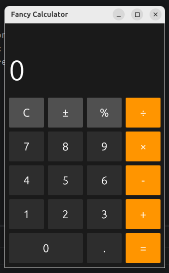

# Fancy Calculator

A modern desktop calculator application built with Rust using the [egui](https://github.com/emilk/egui) GUI library.



## Features

- **Basic Operations**: Addition (+), Subtraction (-), Multiplication (×), Division (÷)
- **Additional Functions**:
  - Clear (C) - Reset calculator
  - Sign Change (±) - Toggle positive/negative
  - Percentage (%) - Calculate percentage
- **Decimal Support**: Full decimal number support
- **Dark Theme**: Modern iOS/macOS-inspired dark UI
- **Previous Calculation Display**: Shows the previous operation and value

## Requirements

- Rust (1.70+ recommended)
- Cargo (comes with Rust)

## Installation

1. Clone the repository:
   ```bash
   cd rust/calc
   ```

2. Build the project:
   ```bash
   cargo build --release
   ```

3. Run the calculator:
   ```bash
   cargo run --release
   ```

## Usage

| Button | Function |
|--------|----------|
| 0-9 | Number input |
| + | Addition |
| - | Subtraction |
| × | Multiplication |
| ÷ | Division |
| = | Calculate result |
| C | Clear all |
| ± | Change sign (+/-) |
| % | Percentage |
| . | Decimal point |

## Project Structure

```
calc/
├── src/
│   └── main.rs      # Main application code
├── Cargo.toml      # Project manifest
├── Cargo.lock      # Dependency lock file
└── README.md       # This file
```

## Dependencies

- [eframe](https://crates.io/crates/eframe) - Pure Rust GUI library
- [egui](https://crates.io/crates/egui) - Immediate mode GUI library

## License

MIT License
